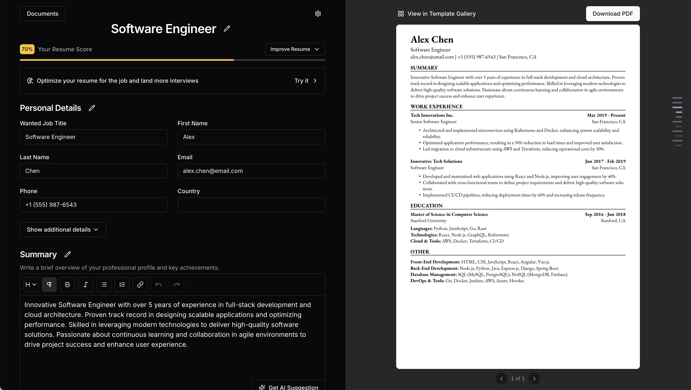

<h1>ZenCV - Intelligent and Secure Resume Builder <a href="https://zencv.vercel.app" target="_blank">(Live Demo)</a></h1>

ZenCV is a modern web application that allows users to create professional-looking resumes in just minutes. The app is completely free, works offline, and ensures maximum privacy by keeping user data stored locally without ever leaving the device.

With ZenCV, users can:

- Create an unlimited number of resumes

- Generate customized resumes tailored to specific job listings

- Personalize their resumes with different design templates

- Optimize their CVs for the targeted position with AI assistance

In this project, I:

- Developed a fast, SEO-friendly, and user experience-focused interface using Next.js and React

- Enhanced code security and maintainability using TypeScript

- Designed a modern, responsive UI with TailwindCSS

- Integrated Google Gemini AI API to optimize content based on the job position

- Used DexieDB (IndexedDB wrapper) to store data locally on the device, ensuring 100% privacy and offline functionality
