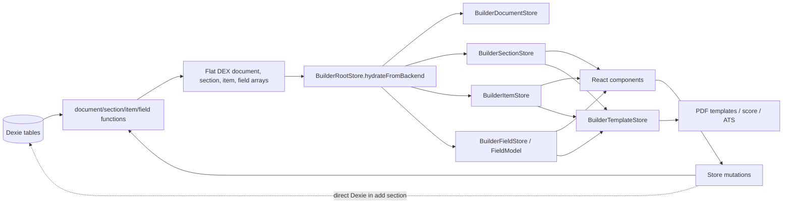
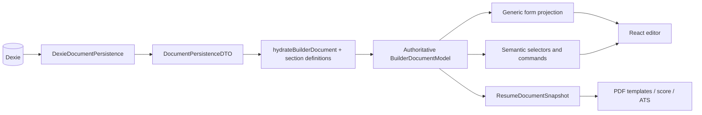
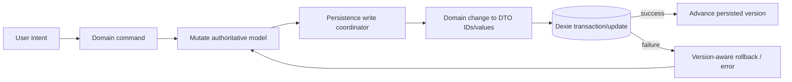

# Document Builder Store Architecture Audit

## Executive Summary

The current persistence-shaped MobX architecture is a major contributor to the Document Builder's lookup friction, but normalization itself is not the root problem. The root problem is that the normalized `document -> sections -> items -> fields` representation is also the public interface consumed by stores, helpers, React components, scoring, and PDF templates. The code has no durable semantic seam between the Dexie record graph and application concepts.

Two related design choices make that leak costly:

- `DEX_Field.name` is both a human-facing label and the closest thing the application has to semantic identity. Built-in concepts such as role, employer, and start date are recovered by matching strings such as `"Job Title"` and `"Start Date"`.
- Field behavior and layout are partly inferred from field type and array position. Date pairing depends on adjacent `date-month` records, additional details are the records after index six, and URL behavior is selected by checking whether the label is `"Link"`.

The code already contains a partial semantic projection in `BuilderTemplateStore.personalDetails` and `summarySection`, which demonstrates the benefit. It stops too early: other sections are reassembled as generic persistence-shaped records and then converted again in template helpers, collapsible headers, ATS checks, score calculations, and UI navigation.

The recommended direction is a hybrid domain model:

- Keep the existing Dexie schema and normalized entity indexes.
- Make those indexes and persistence IDs internal implementation details of the builder module.
- Add a section-definition registry with stable application field keys, separate labels, control/layout metadata, and legacy persisted-name mappings.
- Hydrate persistence DTOs once into one authoritative MobX document model. Built-in sections expose typed item interfaces; custom sections expose a generic field collection.
- Let typed accessors and generic rendering share the same observable field objects, so there is no second independently mutable copy of document state.
- Move Dexie transactions and DTO construction behind one document-persistence seam.

This can be introduced incrementally. Work Experience is the best first vertical migration because the same semantic fields currently feed form rendering, collapsible headings, PDF output, resume scoring, ATS checks, dates, rich text, add/remove, and reorder behavior.

## Current Architecture

### Read and hydration flow

1. `BuilderPage` parses the route ID and calls `BuilderDocumentStore.initializeStore()` (`src/app/builder-page.tsx:22`, `src/app/builder-page.tsx:37`).
2. `initializeStore()` calls `getFullDocumentStructure()` (`src/lib/stores/documentBuilder/builderDocumentStore.ts:39`).
3. `getFullDocumentStructure()` opens a Dexie read transaction, loads the document, then loads sections by `documentId`, items by section IDs, and fields by item IDs (`src/lib/client-db/documentService.ts:134`). It returns four flat persistence arrays.
4. `BuilderRootStore.hydrateFromBackend()` passes the document record directly to `BuilderDocumentStore`, sorts section and item records by `displayOrder`, parses section metadata JSON, and passes field records directly to `BuilderFieldStore` (`src/lib/stores/documentBuilder/builderRootStore.ts:49`).
5. `BuilderFieldStore` wraps each `DEX_Field` in `FieldModel`, but `FieldModel` retains the persistence record shape and exposes snapshots of that shape (`src/lib/stores/documentBuilder/builderFieldStore.ts:10`, `src/lib/stores/documentBuilder/builderFieldStore.ts:103`). Sections and items remain record-shaped arrays.
6. `BuilderTemplateStore` reacts to the normalized stores and builds debounced PDF, score, and ATS projections (`src/lib/stores/documentBuilder/builderTemplateStore.ts:333`).
7. React components access the root singleton directly and traverse entity stores using IDs. Examples include `DocumentSection`, `SectionItem`, `PersonalDetailsLinks`, and `ResumeScoreSuggestionItem`.



### Selector and rendering flow

- `BuilderSectionStore` builds `sectionsByType`, `sectionsById`, and `sectionsWithItems`, but the results remain record-shaped (`src/lib/stores/documentBuilder/builderSectionStore.ts:69`).
- `BuilderItemStore` indexes item records by ID and section ID (`src/lib/stores/documentBuilder/builderItemStore.ts:59`).
- `BuilderFieldStore` indexes fields by ID and item ID, returning `DEX_Field[]` snapshots (`src/lib/stores/documentBuilder/builderFieldStore.ts:126`, `src/lib/stores/documentBuilder/builderFieldStore.ts:190`).
- `SectionItem` joins item -> section and item -> fields at render time, then passes generic field records to `useFieldMapper()` (`src/components/documentBuilder/SectionItem.tsx:25`).
- `BuilderTemplateStore.mappedSections` rebuilds nested sections -> items -> fields (`src/lib/stores/documentBuilder/builderTemplateStore.ts:132`). PDF section components then call helper functions that scan those fields by name (`src/components/appHome/resumeTemplates/resumeTemplates.helpers.ts:45`).

### Mutation and persistence flow

There is no single autosave mechanism. Persistence behavior varies by operation:

- Field values update in memory immediately and save after a 400 ms per-field debounce. A version guard rolls back only the latest failed update to `lastPersistedValue` (`src/lib/stores/documentBuilder/builderFieldStore.ts:8`, `src/lib/stores/documentBuilder/builderFieldStore.ts:55`). Some controls use local-only updates and persist on blur, such as URL and date inputs (`src/components/documentBuilder/inputs/WebLinkFieldInput.tsx:34`, `src/components/documentBuilder/inputs/DateFieldInput.tsx:73`).
- Document title, template settings, section title, metadata, and reorder operations update optimistically, call a persistence function immediately, and roll back on failure.
- Item and section deletion optimistically removes related records from multiple stores, calls a transactional persistence function, then restores array snapshots on failure (`src/lib/stores/documentBuilder/builderItemStore.ts:167`, `src/lib/stores/documentBuilder/builderSectionStore.ts:329`).
- Item creation persists through `itemService` before adding returned records to the stores (`src/lib/stores/documentBuilder/builderItemStore.ts:93`).
- Section creation is implemented as a Dexie transaction directly inside `BuilderSectionStore`, including uniqueness, link limits, DTO creation, inserts, and hydration of returned records (`src/lib/stores/documentBuilder/builderSectionStore.ts:191`).

### Current responsibility allocation

**Persistence layer**

- Defines the normalized schema and record types.
- Loads flat record sets and owns some transactions and cascading deletes.
- Creates documents and copies persistence graphs.
- Does not provide a document-oriented application result or semantic field identity.

**Store layer**

- Holds persistence records or thin wrappers around them.
- Builds indexes and manually joins relationships.
- Owns optimistic mutation and rollback.
- Owns some persistence orchestration and, for section creation, direct Dexie access.
- Owns a partial presentation projection for PDF data, score, and ATS checks.

**React and PDF components**

- Render generic record-driven forms.
- Traverse IDs to recover section and item context.
- Select specialized controls from record type or field name.
- Recover semantic values for headings, scoring actions, PDF entries, and navigation.

The seams are blurred in both directions: persistence DTOs are public UI types, while store modules depend on UI-defined types and presentation constants.

## Findings

### F-01 - The normalized persistence graph is the builder's public interface

**Severity: High**

**Evidence**

- `BuilderDocumentStore.document` is `DEX_Document | null` (`src/lib/stores/documentBuilder/builderDocumentStore.ts:20`).
- `BuilderItemStore.items` is `DEX_Item[]` (`src/lib/stores/documentBuilder/builderItemStore.ts:22`).
- `BuilderFieldStore` accepts and returns `DEX_Field` records (`src/lib/stores/documentBuilder/builderFieldStore.ts:141`, `src/lib/stores/documentBuilder/builderFieldStore.ts:154`, `src/lib/stores/documentBuilder/builderFieldStore.ts:190`).
- `TemplateDataSection` directly extends a parsed `DEX_Section` and contains `DEX_Item & { fields: DEX_Field[] }` (`src/lib/types/documentBuilder.types.ts:57`, `src/lib/types/documentBuilder.types.ts:86`).
- Twenty-eight files under Document Builder UI, resume-template helpers, and hooks import persistence schema types directly.

**Current behavior**

The store layer provides table-like caches and indexes. Consumers must know that a section owns items through `sectionId`, an item owns fields through `itemId`, and semantic data lives in generic field records.

**Why this is a problem**

Every semantic consumer pays the join and interpretation cost. The interface has nearly the same complexity as the implementation, so the entity stores are shallow modules for application callers. Changes to storage naming, shape, or relationship strategy propagate through components and output logic.

**Root cause**

The original table-driven renderer made the persistence representation double as the application model. No semantic seam was added as product behavior became section-specific.

**Recommended direction**

Keep normalized maps as a private identity map if useful, but expose a document model with section and item concepts. Components should import builder IDs and domain interfaces, not `DEX_*` types.

### F-02 - Human-facing field names are used as semantic identifiers

**Severity: High**

**Evidence**

- `DEX_Field.name` is typed as `FieldName`; there is no separate key or label (`src/lib/client-db/clientDbSchema.ts:40`).
- `FIELD_NAMES` values are display strings such as `"Job Title"`, `"Employer"`, and `"Start Date"` (`src/lib/stores/documentBuilder/documentBuilder.constants.ts:87`).
- Inputs render `field.name` as their label (`src/components/documentBuilder/SectionField.tsx:74`, `src/components/documentBuilder/inputs/DateFieldInput.tsx:85`).
- Semantic readers compare the same property to `FIELD_NAMES`, including collapsible titles, PDF mappings, scoring, ATS checks, focus navigation, and URL control selection.
- `getFieldValueByName()` scans every field globally rather than scoping by section or item (`src/lib/stores/documentBuilder/builderFieldStore.ts:146`).

**Current behavior**

The application treats a user-visible English label as a discriminator. Context sometimes comes from the section type, but the stored record itself does not carry a stable application key such as `role`, `company`, or `startDate`.

**Why this is a problem**

Copy changes, localization, duplicate labels, and legacy records can change application behavior. TypeScript only proves that a string belongs to the union of all known labels; it does not prove that `"Description"` belongs to an Education item rather than Work Experience.

A concrete warning is `getEducationSectionEntries()`, which requests `FIELD_NAMES.WORK_EXPERIENCE.DESCRIPTION` for an Education item (`src/components/appHome/resumeTemplates/resumeTemplates.helpers.ts:93`). It happens to work only because both constants currently equal `"Description"`.

**Root cause**

The field record conflates semantic identity, persistence token, and display label.

**Recommended direction**

Introduce application-level stable keys scoped by section definition. For compatibility, the mapper can initially translate `(sectionType, persisted field.name)` into a semantic key while labels come from definitions. A database column is not required for the first migration.

### F-03 - Semantic mapping exists, but it happens late and repeatedly

**Severity: Medium**

**Evidence**

- `BuilderTemplateStore.personalDetails` already projects fields into `firstName`, `lastName`, `jobTitle`, and other semantic properties (`src/lib/stores/documentBuilder/builderTemplateStore.ts:95`).
- `summarySection` similarly exposes a semantic `summary` property (`src/lib/stores/documentBuilder/builderTemplateStore.ts:121`).
- Other sections are rebuilt as generic `items[].fields[]` by `mappedSections` (`src/lib/stores/documentBuilder/builderTemplateStore.ts:132`).
- `resumeTemplates.helpers.ts` repeats field scans for Work Experience, Education, Skills, Internships, Languages, Courses, Custom, and References (`src/components/appHome/resumeTemplates/resumeTemplates.helpers.ts:45`).
- `getTriggerContent()` repeats a parallel set of section-specific scanners for collapsible headers (`src/lib/helpers/documentBuilderHelpers.ts:190`).
- ATS logic scans Work Experience descriptions again (`src/lib/stores/documentBuilder/builderTemplateStore.ts:256`).

**Current behavior**

Semantic projections are built independently for different consumers. The PDF helper result for a Work Experience item and the collapsible-header result for the same item do not share a domain object or invariant.

**Why this is a problem**

The same knowledge is spread across unrelated modules. Adding or renaming a field requires updating templates, headings, scoring, ATS logic, focus behavior, and potentially form rendering. The existing helper does centralize some PDF scans, but it does not eliminate unstable discovery.

**Root cause**

The application model stops at generic field records. Semantic mapping is treated as view formatting instead of hydration into the active editor model.

**Recommended direction**

Hydrate semantic item models once. PDF, headings, score, and ATS selectors should consume `WorkExperienceItemModel` properties or a semantic read snapshot produced by that model.

### F-04 - Field behavior and layout depend on implicit type and order conventions

**Severity: Medium**

**Evidence**

- `useFieldMapper()` pairs a date field with the next field when both have type `date-month` (`src/hooks/useFieldMapper.tsx:5`).
- `HidableFieldContainer` treats the first six records as primary and the remainder as additional details (`src/components/documentBuilder/HidableFieldContainer.tsx:23`).
- `SectionField` selects `WebLinkFieldInput` only when a string field's name equals the Links `"Link"` label (`src/components/documentBuilder/SectionField.tsx:59`).
- `DateFieldInput` shows a `"Currently here"` / `"Present"` control for every `date-month` field, because it cannot distinguish an end date from a start date (`src/components/documentBuilder/inputs/DateFieldInput.tsx:39`, `src/components/documentBuilder/inputs/DateFieldInput.tsx:157`).
- Fields have no explicit display order in the Dexie schema (`src/lib/client-db/clientDb.ts:31`), and hydration does not sort them (`src/lib/stores/documentBuilder/builderRootStore.ts:70`).

**Current behavior**

The order in which field records are returned and stored encodes layout groups, primary/secondary visibility, and date pairing. Field type is asked to carry behavioral meaning that belongs to the semantic field or section definition.

**Why this is a problem**

Inserting or reordering a field can silently alter layout. A generic date control offers behavior that is not valid for every date role. The renderer is generic, but its hidden conventions are section-specific and not type-checked.

**Root cause**

Template definitions describe records, not a complete application field definition. They lack stable keys and explicit control/layout capabilities.

**Recommended direction**

Add definition metadata such as `control: 'url'`, `allowPresent`, `group: 'dateRange'`, `prominence: 'primary' | 'additional'`, and explicit field order. Keep the renderer generic by rendering definitions rather than inferring semantics from record order.

### F-05 - Persistence orchestration is split across services and stores

**Severity: Medium**

**Evidence**

- Section, item, field, and document persistence functions exist under `src/lib/client-db/`.
- `BuilderSectionStore.addNewSection()` imports `clientDb` and implements a multi-table Dexie transaction directly (`src/lib/stores/documentBuilder/builderSectionStore.ts:3`, `src/lib/stores/documentBuilder/builderSectionStore.ts:205`).
- That store method queries persisted sections to enforce uniqueness, computes order, enforces link limits, constructs DTOs, inserts records, and then mutates three stores (`src/lib/stores/documentBuilder/builderSectionStore.ts:210`).
- Section and item deletion coordinate arrays across multiple stores and own rollback snapshots (`src/lib/stores/documentBuilder/builderSectionStore.ts:329`, `src/lib/stores/documentBuilder/builderItemStore.ts:167`).
- `BuilderItemStore.addNewItemEntry()` derives a new item's `displayOrder` from the maximum across every document item, not the target section, and does not increment that maximum (`src/lib/stores/documentBuilder/builderItemStore.ts:130`). This can produce duplicate order values and lets unrelated sections affect the result.

**Current behavior**

Some persistence invariants live in client-db functions and others live in MobX stores. Add-section behavior uses the database as the source for rule checks, then manually hydrates returned records into in-memory state.

**Why this is a problem**

There is no single module whose interface owns a builder command end to end. Transaction details and table DTOs enter the store implementation, while multi-store consistency and rollback logic are duplicated per mutation. The item-order calculation is a concrete example of a section rule being implemented against a global table-shaped collection.

**Root cause**

The entity-store split encouraged one store per table, but real commands such as add section and delete section span several entities.

**Recommended direction**

Define one document-persistence seam for whole builder operations, backed by a Dexie adapter and an in-memory test adapter. Keep optimistic state transitions in the document model, but place transactions, cascades, limits that require durable concurrency, and DTO assembly behind the persistence interface.

### F-06 - Presentation and store modules depend on each other's types

**Severity: Low**

**Evidence**

- `BuilderSectionStore` imports `OtherSectionOption` from the React `AddSectionWidget` (`src/lib/stores/documentBuilder/builderSectionStore.ts:3`).
- `documentBuilder.constants.ts` also imports that UI type and includes Lucide icon components in section options (`src/lib/stores/documentBuilder/documentBuilder.constants.ts:1`, `src/lib/stores/documentBuilder/documentBuilder.constants.ts:9`).
- `AddSectionWidget.OtherSectionOption` extends `DEX_Section` and uses `DEX_Item['containerType']` (`src/components/documentBuilder/AddSectionWidget.tsx:15`).

**Current behavior**

A persistence-shaped UI option type is defined in a component, then imported downward into stores and constants. Domain choices, persistence fields, and icon presentation are one object.

**Why this is a problem**

It makes the dependency direction circular and makes non-React command use or testing carry UI concepts. It also obscures which properties are required to add a domain section versus render a menu option.

**Root cause**

There is no application-level section-kind definition independent of both persistence DTOs and menu presentation.

**Recommended direction**

Define `SectionKind` and `AddSectionCommand` in the builder domain module. Map menu options to commands in the UI; keep icons and menu copy in the UI layer.

### F-07 - Cross-entity traversal leaks into UI workflows

**Severity: Medium**

**Evidence**

- `PersonalDetailsLinks` finds link sections by type, flattens item IDs across sections, enforces a count, and chooses between adding a section and adding an item (`src/components/documentBuilder/PersonalDetailsLinks.tsx:16`).
- `ResumeScoreSuggestionItem` finds sections by type, scans items by `sectionId`, scans fields by `itemId`, finds an empty item, or creates an item (`src/components/documentBuilder/resumeScore/ResumeScoreSuggestionItem.tsx:53`).
- `BuilderUIStore.getFieldRefByFieldNameAndSection()` traverses section -> items -> fields to find a semantic target (`src/lib/stores/documentBuilder/builderUIStore.ts:44`).
- `RichTextCharacterCounter` receives an `itemId`, traverses back to the section type through a helper, then selects section-specific rules (`src/components/documentBuilder/RichTextCharacterCounter.tsx:51`).

**Current behavior**

UI interactions know the record graph and reconstruct domain operations such as add link, focus email, find empty experience, and apply the correct character guidance.

**Why this is a problem**

The React layer owns workflow rules and relationship knowledge. Those rules cannot be reused or tested through a small builder interface, and a storage change would affect UI control flow.

**Root cause**

Stores expose entity retrieval, not intent-oriented operations and semantic references.

**Recommended direction**

Expose commands such as `document.links.add()`, `section.addItem()`, `section.firstEmptyItem`, and `document.focusTarget({ section: 'personalDetails', field: 'email' })`. UI state may own DOM refs, but domain selection should return stable domain IDs rather than traverse persistence records.

### F-08 - Normalized entity stores are useful internally, but currently too public

**Severity: Low**

**Evidence**

- `itemsById`, `itemsBySectionId`, `fieldsById`, `fieldsByItemId`, `sectionsById`, and `sectionsByType` provide efficient identity and relationship indexes.
- Reorder, deletion, and hydration tests exercise these indexes and optimistic rollback (`src/lib/stores/documentBuilder/__tests__/documentBuilderStores.test.ts:401`, `src/lib/stores/documentBuilder/__tests__/documentBuilderStores.test.ts:573`, `src/lib/stores/documentBuilder/__tests__/documentBuilderStores.test.ts:649`).

**Current behavior**

The entity stores function as observable repositories or table caches. They are useful for identity, joins, and incremental mutation, but are also the application interface.

**Why this is a problem**

Replacing them wholesale would add risk without solving a problem unique to normalization. Leaving them public, however, keeps relationship and semantic complexity in every caller.

**Root cause**

Internal storage mechanics and external application interface were never separated.

**Recommended direction**

Retain normalized maps as a private implementation if they continue to simplify identity and writes. Place typed section and item models over the same `FieldModel` instances. The deletion test supports this: deleting the semantic module today would not change much because callers already implement its missing behavior themselves; adding it would concentrate that behavior and earn its interface.

## Persistence Leakage

The following are concrete storage concepts visible above the persistence layer:

| Location | Symbol | Leakage and consequence |
| --- | --- | --- |
| `src/components/documentBuilder/SectionItem.tsx:25` | `ContainerElement` | Accepts `DEX_Item`, joins fields and section by foreign keys, then decides UI container behavior from a persistence property. |
| `src/components/documentBuilder/SectionField.tsx:28` | `SectionField` | Reads a `DEX_Field` snapshot and switches on persistence type and label. It also traverses item -> section for rich-text accessibility context. |
| `src/components/documentBuilder/PersonalDetailsLinks.tsx:16` | `PersonalDetailsLinks` | Reconstructs the Links concept from section types and item IDs, then decides whether to create a section or item. |
| `src/components/documentBuilder/resumeScore/ResumeScoreSuggestionItem.tsx:53` | `handleSuggestionClick` | Rebuilds section/item/field relationships to find an empty semantic entry. |
| `src/components/documentBuilder/resumeOverview/ResumeOverViewContent.tsx:30` | `ResumeOverViewContent` | Consumes sections-with-items records and calls a global helper that rescans item fields for semantic titles. |
| `src/components/appHome/resumeTemplates/resumeTemplates.helpers.ts:20` | `findValueInItemFields` | PDF-facing application data is derived by scanning `DEX_Field[]` with display-label constants. |
| `src/lib/stores/documentBuilder/builderTemplateStore.ts:132` | `mappedSections` | Reconstructs a nested persistence graph rather than exposing a semantic resume snapshot. |
| `src/lib/stores/documentBuilder/builderSectionStore.ts:191` | `addNewSection` | A MobX store owns a raw multi-table Dexie transaction and manually pushes resulting records into three entity stores. |
| `src/lib/types/documentBuilder.types.ts:62` | `PdfTemplateData` | A nominal UI/output type still embeds persistence-shaped `TemplateDataSection` values. |

Using numeric IDs in drag-and-drop or DOM keys is not itself a serious leak. The architectural issue is that UI code must understand what the IDs relate and what generic records mean. Replacing `DEX_Item['id']` with a branded `ItemId` would improve dependency direction, but it would not solve semantic discovery on its own.

## Semantic Lookup Analysis

### How lookups work today

**Job title, employer, and dates**

- Collapsible headings call `getTriggerContent(itemId)`, look up the item, look up its section type, retrieve fields by item ID, and find values by `field.name` (`src/lib/helpers/documentBuilderHelpers.ts:190`, `src/lib/helpers/documentBuilderHelpers.ts:240`).
- PDF output independently maps the same fields by name (`src/components/appHome/resumeTemplates/resumeTemplates.helpers.ts:45`).
- ATS independently finds Work Experience description fields by name (`src/lib/stores/documentBuilder/builderTemplateStore.ts:256`).

**Personal details**

- `BuilderTemplateStore.personalDetails` calls the global `getFieldValueByName()` for each property (`src/lib/stores/documentBuilder/builderTemplateStore.ts:95`). This is concise, but it relies on those labels being globally unique and on the intended section being present.

**Links**

- Form behavior identifies the URL field by comparing the display name to `FIELD_NAMES.WEBSITES_SOCIAL_LINKS.LINK` (`src/components/documentBuilder/SectionField.tsx:61`).
- PDF link output scans for label and link names, normalizes the URL, and creates an entry (`src/components/appHome/resumeTemplates/resumeTemplates.helpers.ts:102`).
- The Personal Details UI reconstructs all Links sections and items by type and ID (`src/components/documentBuilder/PersonalDetailsLinks.tsx:19`).

**Primary and paired fields**

- Primary fields are inferred by array position, with the first six shown before the disclosure control (`src/components/documentBuilder/HidableFieldContainer.tsx:23`).
- Start/end date pairing is inferred because two `date-month` records are adjacent (`src/hooks/useFieldMapper.tsx:8`).
- The first focus target is simply `fields[0]` (`src/lib/stores/documentBuilder/builderUIStore.ts:66`).

### Root-cause assessment

The issue is a combination of factors:

1. **Missing stable semantic field identity - primary cause.** `field.name` is a display label and semantic key at once.
2. **Persistence-shaped store interface - primary cause.** Callers receive records and foreign keys instead of domain concepts.
3. **Insufficient domain abstractions - primary cause.** There is no Work Experience item, Education item, Link item, or Personal Details model through which shared behavior can be expressed.
4. **Weak field/template definitions - contributing cause.** Definitions specify name, basic field type, options, and placeholder, but not semantic key, control capability, layout group, visibility tier, or whether `Present` is valid.
5. **Inappropriate component responsibilities - symptom and contributor.** React code reconstructs domain workflows because stores do not expose them.

### Legitimate generic rendering versus accidental complexity

Generic rendering is valuable for the editor and essential for custom sections. It is reasonable for a renderer to switch on explicit control metadata and render a list of editable fields. It is also reasonable for normalized indexes to resolve object identity internally.

The accidental complexity is the need to infer control metadata and meaning from persistence artifacts. A generic renderer consuming `EditableFieldModel[]` with `key`, `label`, `control`, `layout`, `value`, and `setValue()` is still generic. A renderer consuming `DEX_Field[]` and guessing URL, date range, importance, and semantic identity from name/type/order is not.

## Store Responsibilities

`BuilderSectionStore`, `BuilderItemStore`, and `BuilderFieldStore` currently act primarily as observable repositories or cache representations of database tables:

- Their state collections align one-to-one with Dexie tables.
- Their principal selectors are ID maps and foreign-key groupings.
- Their mutation methods translate directly into persistence operations.
- They do not encapsulate most section-specific behavior.

`FieldModel` is the main exception. It adds application behavior through observable value state, debounced persistence, versioning, rollback, and disposal. That behavior is worth retaining, but `FieldModel` still presents a persistence-shaped snapshot and has no semantic key.

The split by entity remains useful internally for:

- identity maps and stable record lookup;
- efficient relationship indexing;
- preserving the current Dexie write model;
- optimistic rollback and disposal of pending field writes;
- generic/custom-section support.

It should not remain the interface used by React, PDF templates, scoring, or semantic helpers.

## Target State Model

### Three distinct representations

1. **Persistence DTOs** - Dexie record shapes used only by the persistence adapter and mapper.
2. **Application/domain state** - the authoritative active-editor MobX graph, with typed built-in sections and shared editable field objects.
3. **Transient UI state** - current view, expanded item, DOM refs, popovers, preview rendering state, and local validation/touched flags.

### Representative TypeScript shape

```ts
type SectionId = number;
type ItemId = number;
type FieldId = number;

type FieldControl =
  | { kind: 'text'; inputMode?: 'text' | 'email' | 'tel' | 'url' }
  | { kind: 'month'; allowPresent: boolean }
  | { kind: 'richText'; guidance?: 'summary' | 'experience' }
  | { kind: 'select'; options: readonly string[] }
  | { kind: 'textarea' };

interface FieldDefinition<Key extends string> {
  key: Key;
  persistedName: string; // Compatibility mapping, not UI identity
  label: string;
  control: FieldControl;
  order: number;
  group?: 'dateRange';
  prominence?: 'primary' | 'additional';
}

class EditableFieldModel<Key extends string> {
  readonly id: FieldId;
  readonly key: Key;
  readonly definition: FieldDefinition<Key>;
  value: string;

  setValue(next: string): Promise<StoreResult>;
}

class WorkExperienceItemModel {
  readonly id: ItemId;
  readonly kind = 'workExperience';
  readonly fields: {
    role: EditableFieldModel<'role'>;
    company: EditableFieldModel<'company'>;
    startDate: EditableFieldModel<'startDate'>;
    endDate: EditableFieldModel<'endDate'>;
    city: EditableFieldModel<'city'>;
    description: EditableFieldModel<'description'>;
  };

  get role(): string {
    return this.fields.role.value;
  }

  get company(): string {
    return this.fields.company.value;
  }

  get heading(): { title: string; description: string };
  get editableFields(): readonly EditableFieldModel<string>[];
  update(patch: Partial<WorkExperienceValues>): Promise<StoreResult>;
}

interface WorkExperienceSectionModel {
  readonly id: SectionId;
  readonly kind: 'workExperience';
  title: string;
  items: readonly WorkExperienceItemModel[];
  addItem(): Promise<WorkExperienceItemModel | undefined>;
  removeItem(itemId: ItemId): Promise<StoreResult>;
  reorder(itemIds: readonly ItemId[]): Promise<StoreResult>;
}

interface GenericItemModel {
  readonly id: ItemId;
  readonly kind: 'generic';
  readonly editableFields: readonly EditableFieldModel<string>[];
  field(key: string): EditableFieldModel<string> | undefined;
}

type BuilderSectionModel =
  | WorkExperienceSectionModel
  | EducationSectionModel
  | PersonalDetailsSectionModel
  | LinksSectionModel
  | SkillsSectionModel
  | GenericSectionModel;

class BuilderDocumentModel {
  readonly id: number;
  title: string;
  template: ResumeTemplate;
  sections: readonly BuilderSectionModel[];

  get personalDetails(): PersonalDetailsModel;
  get workExperience(): WorkExperienceSectionModel | undefined;
  get links(): LinksSectionModel | undefined;
  addSection(kind: AddableSectionKind): Promise<BuilderSectionModel | undefined>;
  removeSection(sectionId: SectionId): Promise<StoreResult>;
  reorderSections(sectionIds: readonly SectionId[]): Promise<StoreResult>;
  toResumeSnapshot(): ResumeDocumentSnapshot;
}
```

`editableFields` and typed accessors must reference the same `EditableFieldModel` objects. There should not be one mutable `role` string plus a separate mutable generic field value.

### Section definitions

A declarative registry should own the relationship between stable application keys, existing persisted names, labels, controls, layout, default fields, and item-heading formatting:

```ts
const workExperienceDefinition = defineSection({
  kind: 'workExperience',
  persistedType: 'work-experience',
  fields: [
    { key: 'role', persistedName: 'Job Title', label: 'Job title', control: { kind: 'text' }, order: 1 },
    { key: 'company', persistedName: 'Employer', label: 'Company', control: { kind: 'text' }, order: 2 },
    { key: 'startDate', persistedName: 'Start Date', label: 'Start date', control: { kind: 'month', allowPresent: false }, order: 3, group: 'dateRange' },
    { key: 'endDate', persistedName: 'End Date', label: 'End date', control: { kind: 'month', allowPresent: true }, order: 4, group: 'dateRange' },
    { key: 'city', persistedName: 'City', label: 'City', control: { kind: 'text' }, order: 5 },
    { key: 'description', persistedName: 'Description', label: 'Description', control: { kind: 'richText', guidance: 'experience' }, order: 6 },
  ],
});
```

The `persistedName` strings preserve compatibility with existing records. They are used only at the mapper seam. Future label changes do not change identity. A later database migration adding `semanticKey` may be worthwhile if runtime-created field definitions or localization are introduced, but it is not required to establish the application seam now.

### Generic and typed sections

The current custom section is generic in product meaning but still uses a predefined five-field record template (`src/lib/misc/fieldTemplates.ts:162`). It does not justify generating a bespoke class for every section.

Recommended split:

- Strongly type built-in sections whose fields drive section-specific behavior: Personal Details, Summary, Work Experience, Education, Links, Skills, Languages, References, Courses, and Internships.
- Reuse model implementations when shapes match. Work Experience and Internships can share an `ExperienceItemModel` with different section kinds and labels.
- Use small semantic models for simple sections, such as Hobbies and Summary.
- Keep Custom as `GenericSectionModel`, driven by a definition and generic renderer.
- Preserve unknown legacy fields as generic `EditableFieldModel` values rather than dropping them. The mapper should report missing, duplicate, and unknown fields for diagnostics.

Adding a built-in section should normally require one definition and, only when it has real behavior, one typed facade. It should not require a new persistence table, repository, or renderer.

## Proposed Data Flow

### Read path



Hydration should perform the section -> item -> field joins once, resolve field semantic keys using section definitions, parse metadata, validate built-in shapes, and create observable models. Internal maps may still index the same objects by persistence ID.

### Write path



Operation details:

- **Field update:** mutate the domain field immediately, debounce by field ID, persist through the coordinator, and use the existing version-aware rollback principle. The domain field owns current editor value; Dexie is the durable last-confirmed snapshot.
- **Add item:** call `section.addItem()`. The section definition supplies required fields. Preserve the current persist-first behavior initially so Dexie allocates IDs and no temporary-ID system is needed. Hydrate the returned DTO into the same domain model type and insert it once.
- **Remove item/section:** snapshot the affected domain objects, optimistically detach them, execute a transactional cascade in the persistence adapter, then dispose pending field writes on success or reattach the same objects on failure.
- **Reorder:** update the section or item order in the document model, persist all changed `displayOrder` values transactionally, and roll back the previous order on failure.
- **Metadata and title:** expose semantic commands and keep current optimistic rollback behavior. Metadata serialization belongs in the mapper/adapter, not React or section stores.
- **Serialization/copy:** produce persistence DTOs from domain models only when a whole-document operation needs them. Do not maintain a continuously synchronized second DTO tree in memory. Pure record cloning can remain a persistence concern if it intentionally preserves unknown fields exactly.

The active `BuilderDocumentModel` is authoritative while the editor is open. Dexie is authoritative across sessions. This is one source of mutable editor truth plus a durable snapshot, not two independently editable models.

## Ownership Boundaries

### Persistence and services

Own:

- Dexie schema and migrations;
- raw `DEX_*` DTOs;
- queries, transactions, cascades, and durable concurrency checks;
- allocation of numeric persistence IDs;
- serialization of metadata and template settings;
- exact record cloning for copy operations;
- a document-oriented persistence interface and its Dexie adapter.

Do not expose `DEX_*` types to React or PDF templates.

### Domain and store layer

Own:

- the authoritative active document model;
- section and item identity and order;
- stable semantic field keys;
- built-in section invariants and item-heading logic;
- intent-oriented add/remove/reorder/update commands;
- optimistic transitions and rollback coordination;
- semantic selectors for PDF, score, ATS, overview, and navigation;
- generic editable field projections from section definitions.

Normalized maps may remain private implementation details.

### UI state

Own:

- builder/preview/template view selection;
- expanded item ID;
- DOM refs and focus execution;
- mobile selector visibility;
- touched/error display state and transient dialog state;
- preview render state.

The UI store may ask the domain model for a semantic target, but it should not traverse section/item/field persistence relationships to discover it.

### React components

Own:

- rendering and event wiring;
- generic control selection from explicit field definitions;
- layout using explicit groups/prominence;
- presentation-only formatting;
- dispatching domain commands.

Components should not query Dexie, import persistence DTOs, reconstruct semantic fields, or coordinate multi-entity mutations.

## Migration Plan

### Phase 1 - Introduce stable semantic field definitions

**Scope**

- Define application field keys and section definitions for existing built-ins.
- Include `persistedName`, label, control, explicit order, grouping, prominence, and capabilities such as `allowPresent`.
- Add mapper tests proving every existing field template maps exactly once for its section type.
- Add compatibility tests for duplicate labels across section types and unknown legacy fields.

**Expected benefit**

- Stops new code from adding label and order inference.
- Separates UI copy from identity without changing Dexie.

**Major risk**

- Existing records may contain names not represented in current templates. The mapper must preserve unknown fields and report them rather than silently discard data.

**What remains unchanged**

- Dexie schema, current stores, current mutations, and current UI continue to work.

### Phase 2 - Add a hydration mapper and semantic facades over existing field models

**Scope**

- Join loaded records once using internal maps.
- Create typed item facades that reference existing `FieldModel` instances.
- Add a `BuilderDocumentModel` interface at the root while leaving normalized stores private behind it.
- Replace `getFieldValueByName()` in new code with scoped semantic access.

**Expected benefit**

- Creates the durable seam without duplicating mutable values.
- Allows old and new consumers to coexist during migration.

**Major risk**

- Accidentally creating wrapper values instead of wrapper references would create two sources of truth. Tests must assert identity and bidirectional reactivity.

**What remains unchanged**

- `FieldModel` debounce/version behavior and persistence functions can remain initially.

### Phase 3 - Migrate Work Experience vertically

**Scope**

- Introduce `ExperienceItemModel` and Work Experience section access.
- Migrate collapsible headings, form field definitions, PDF projection, score checks, ATS checks, rich-text guidance, date range behavior, and focus targeting.
- Keep the existing PDF visual components, but pass semantic entries instead of `TemplateDataSection`.

**Expected benefit**

- Removes several duplicated field scanners in one change and proves the model across read, edit, output, and navigation paths.

**Major risk**

- It touches several consumers. Protect behavior with hydration, mutation, heading, score, ATS, and PDF snapshot/unit tests before switching callers.

**What remains unchanged**

- Other sections continue through the current generic path; Dexie records and IDs are unchanged.

### Phase 4 - Move generic rendering to explicit definitions

**Scope**

- Change the renderer to consume `editableFields` and their definition metadata.
- Remove name-based URL selection, adjacent-date inference, first-six inference, and unconditional `Present` behavior.
- Keep Custom on the generic renderer.

**Expected benefit**

- Generic rendering remains possible while hidden conventions become explicit and testable.

**Major risk**

- Layout parity across responsive breakpoints and all section types.

**What remains unchanged**

- Reusable input components and current styling can remain.

### Phase 5 - Introduce the document-persistence seam

**Scope**

- Define a document-oriented persistence interface for load and builder commands.
- Implement a Dexie adapter and an in-memory test adapter.
- Move the direct section-creation transaction, DTO assembly, cascades, metadata serialization, and durable limit checks behind it.
- Inject the adapter into the root store instead of importing the database singleton inside state models.

**Expected benefit**

- One module owns persistence mechanics, and domain tests run against the same interface callers use.

**Major risk**

- Over-expanding the interface into one method per table operation. Design around builder commands and transactional outcomes, not table CRUD.

**What remains unchanged**

- Existing Dexie schema and transaction semantics.

### Phase 6 - Migrate remaining semantic consumers

**Scope**

- Migrate Personal Details, Summary, Education, Links, Skills, Internships, Languages, Courses, References, and Hobbies.
- Replace `TemplateDataSection` with a semantic `ResumeDocumentSnapshot`.
- Remove UI imports of `DEX_*` and hide entity stores from the root's public interface.
- Leave Custom and unknown legacy fields on the generic model.

**Expected benefit**

- PDF templates, score, ATS, overview, and React forms use one semantic vocabulary.

**Major risk**

- Template-specific output regressions. Migrate section by section and compare generated data, not only rendered PDFs.

**What remains unchanged**

- PDF visual layout modules and the database schema unless later evidence justifies a migration.

## Example Refactor

Work Experience is the representative section because it exercises more of the current architecture than Personal Details: multiple items, add/remove/reorder, dates, rich text, collapsible headings, score, ATS, and five PDF templates.

### Before

The collapsible header starts with an item ID, traverses item -> section, retrieves all fields for the item, and scans them by display-name constants:

```ts
const itemFields = builderRootStore.fieldStore.getFieldsByItemId(itemId);

const jobTitle = itemFields.find(
  (field) => field.name === FIELD_NAMES.WORK_EXPERIENCE.JOB_TITLE
)?.value ?? '';

const employer = itemFields.find(
  (field) => field.name === FIELD_NAMES.WORK_EXPERIENCE.EMPLOYER
)?.value ?? '';
```

PDF mapping repeats the same discovery in `getWorkExperienceSectionEntries()`. ATS logic separately searches `item.fields` for the description. The form decides that adjacent `date-month` records are a date range.

Updates are field-record oriented:

```ts
await builderRootStore.fieldStore.setFieldValue(fieldId, nextValue);
```

### After

Hydration resolves existing records once:

```ts
const experience = document.workExperience?.itemsById.get(itemId);

experience?.role;          // semantic read
experience?.company;
experience?.startDate;
experience?.endDate;
experience?.description;
experience?.heading;       // shared title/description projection

await experience?.update({ role: nextValue });
```

The generic form still works:

```tsx
{experience.editableFields.map((field) => (
  <BuilderField key={field.id} field={field} />
))}
```

The renderer reads explicit metadata:

```ts
field.definition.key;                  // 'startDate'
field.definition.control.kind;         // 'month'
field.definition.control.allowPresent; // false
field.definition.group;                // 'dateRange'
```

PDF and ATS consumers no longer receive `DEX_Field[]`:

```ts
const resume = document.toResumeSnapshot();

resume.workExperience.items.map((item) => ({
  id: item.id,
  role: item.role,
  company: item.company,
  startDate: item.startDate,
  endDate: item.endDate,
  city: item.city,
  description: item.description,
}));

resume.workExperience.items.some((item) =>
  bulletPointRegex.test(item.description)
);
```

The same observable field object backs `experience.role`, `editableFields`, and persistence. The improvement is not a helper that still scans labels. It is stable semantic identity established during hydration.

## Risks and Tradeoffs

- **More application types and mapper code.** The new seam adds definitions and models. It earns its cost only if raw entity stores stop being the caller interface. Adding wrappers while leaving all old paths public would create indirection without leverage.
- **Legacy compatibility.** Existing stored `name` values must map to semantic keys. Unknown or duplicate fields need explicit behavior and telemetry or diagnostics. The code does not reveal whether users can possess records created by older, renamed templates, so this must be measured before enforcing strict hydration.
- **MobX observability complexity.** Typed getters, generic field arrays, and normalized indexes must all reference the same observable objects. Snapshot copies must not become mutable editor state.
- **Definition registry growth.** A registry can become a second schema. It should contain application behavior and presentation metadata, while Dexie remains responsible for storage concerns. Avoid mirroring every persistence property without purpose.
- **Partial migration coexistence.** Old helpers and new models will coexist for several phases. Mark raw selectors internal/deprecated and prevent new consumers, or the migration may stall.
- **Persistence adapter breadth.** A table-by-table repository layer would merely reproduce Dexie with more files. The interface should be document- and command-oriented, with transactions hidden in the adapter.
- **Typed-section overreach.** Not every section needs a class. Use typed facades only where semantic behavior or consumers justify them, and retain a generic model for Custom and unknown fields.
- **Behavioral parity.** Current implicit behavior may include accidental quirks, such as allowing `Present` on start dates or relying on insertion order. Migration tests must distinguish intended behavior from artifacts rather than automatically preserving every quirk.

## Final Recommendation

Adopt a hybrid, domain-shaped MobX document module over the existing Dexie schema.

The external interface should be one authoritative `BuilderDocumentModel` with semantic sections, typed built-in items, generic custom items, and intent-oriented commands. Internally, the module may retain normalized maps keyed by persistence IDs because they are useful for identity, joins, incremental writes, and rollback. Those maps should no longer be directly consumed by React, template, scoring, or ATS code.

Create a declarative section-definition registry that separates:

- stable application key, such as `role`;
- legacy persisted name, such as `"Job Title"`;
- display label;
- control behavior;
- explicit layout/order metadata;
- section-specific capabilities.

Hydrate flat Dexie DTOs once through those definitions into shared observable field objects and typed facades. Use those same objects for generic form rendering and semantic access, so there is no duplicated mutable document state. Generate a semantic `ResumeDocumentSnapshot` for PDF, score, and ATS consumers. Put Dexie transactions and DTO assembly behind a document-persistence interface, while retaining the current proven optimistic and version-aware rollback patterns.

Do not change the database schema as the first step. The current `name` values can serve as legacy compatibility tokens at the mapper seam. Consider a future `semanticKey` column only if evidence shows ambiguous legacy records, user-defined field schemas, or localization requirements that cannot be handled safely by the mapping registry.

This is the smallest change that creates a durable seam: it preserves storage and much of the current MobX machinery while moving application meaning out of components and persistence-shaped helpers into a deep builder module.
